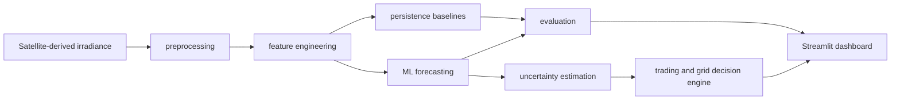

# SolarCast Ops

A satellite-informed solar generation nowcasting and operational decision-support platform for intraday trading and grid balancing.

## Hackathon Problem

SolarCast Ops addresses the **Satellite Data for Solar** challenge as one end-to-end product:

1. Use satellite-derived irradiance and meteorological data to forecast PV generation and compare against persistence baselines.
2. Convert short-term forecasts into simplified intraday trading and grid balancing decisions.
3. Package the workflow into an operator-facing Streamlit dashboard with historical replay.

## Product Users

The target users are solar operators, virtual power plant analysts, intraday traders, and grid balancing teams who need quick, explainable short-term decisions.

## Decision Questions

- Will a 1 MWp Munich-area PV plant over- or under-produce versus schedule in the next 1-3 hours?
- Is the signal large enough to BUY, SELL, or HOLD in the intraday market?
- Is there a meaningful upward or downward ramp risk?
- How does the satellite-informed model compare with simple persistence and history-only ML?

## Architecture



## Data Source

Primary source: European Commission JRC PVGIS 5.3 hourly API (`seriescalc`) using SARAH-3 satellite-derived irradiance where available.

The unified data schema includes:

- `timestamp`
- `pv_power_mw`
- `global_irradiance_wm2`
- `direct_irradiance_wm2`
- `diffuse_irradiance_wm2`
- `air_temperature_c`
- `wind_speed_ms`
- `solar_elevation_deg`
- `data_source`

PVGIS PV power is public modelled PV output for the configured system. It is **not real plant SCADA**.

Fallback behavior:

1. Use local processed cache if available.
2. If no cache exists and API access fails, generate deterministic `synthetic demo data`.
3. Dashboard and metadata clearly flag synthetic fallback.

Synthetic demo data is never presented as real satellite data or real SCADA.

## Installation

```bash
cd solarcast_ops
python3 -m venv .venv
source .venv/bin/activate
pip install -r requirements.txt
```

If LightGBM cannot be installed, the training code falls back to `HistGradientBoostingRegressor`.

## Running

Complete pipeline:

```bash
python3 run_pipeline.py --step all
```

Individual steps:

```bash
python3 run_pipeline.py --step download
python3 run_pipeline.py --step preprocess
python3 run_pipeline.py --step features
python3 run_pipeline.py --step baselines
python3 run_pipeline.py --step train
python3 run_pipeline.py --step irradiance
python3 run_pipeline.py --step evaluate
python3 run_pipeline.py --step demo
```

Force refresh where supported:

```bash
python3 run_pipeline.py --step all --force
```

Dashboard:

```bash
python3 -m streamlit run app/dashboard.py
```

Tests:

```bash
python3 -m pytest -q
```

Makefile shortcuts:

```bash
make install
make all
make app
make test
```

## Project Directory

```text
solarcast_ops/
├── app/
├── config/
├── data/
├── models/
├── reports/
├── src/
├── tests/
├── notebooks/
├── run_pipeline.py
├── requirements.txt
├── README.md
├── .gitignore
└── Makefile
```

## Forecast Task

Three separate hourly forecasts are trained:

- `target_h1`: PV power 1 hour ahead
- `target_h2`: PV power 2 hours ahead
- `target_h3`: PV power 3 hours ahead

Power is in MW. Energy is in MWh. Internal timestamps are UTC.

The h-hour forecasts use current satellite-derived irradiance and historical trends. They do **not** assume future satellite observations are already known.

## Baselines

Ordinary persistence:

```text
pred_persistence_h = current_power
```

Clear-sky persistence:

```text
cloud_factor_t = current_power / clear_sky_power_t
pred_clear_sky_persistence_t_h = cloud_factor_t * clear_sky_power_t_h
```

Nighttime, missing values, tiny denominators, and capacity limits are explicitly handled.

## Features

History-only model:

- Current and lagged PV power
- Rolling power statistics
- Solar elevation
- Clear-sky power
- Hour/day/month cyclic features

Satellite-informed model:

- All history-only features
- Current irradiance components
- Irradiance lags and changes
- Clear-sky index
- Power to clear-sky ratio
- Temperature and wind speed

Rolling features use `shift(1).rolling(...)` to avoid leakage.

## Time Split

Default split:

- Train: earliest data through `2021-12-31 23:00 UTC`
- Validation: 2022
- Test: 2023

If the available time range is too short, the code falls back to chronological 60% / 20% / 20%. It never uses random splitting.

## Metrics

Metrics are reported for all samples and daylight samples:

- MAE
- RMSE
- nMAE
- nRMSE
- R²
- Forecast Skill against persistence
- Forecast Skill against clear-sky persistence

Forecast Skill:

```text
1 - error_model / error_baseline
```

The default skill error is MAE.

Weather condition segments are heuristic:

- Clear: clear-sky index >= 0.72 and recent irradiance variability < 140 W/m²
- Overcast: clear-sky index < 0.35
- Variable-cloud: all other daylight/test cases

This is an operational heuristic, not a strict meteorological classification.

## Uncertainty

The MVP uses empirical validation residuals to produce:

- `forecast_p10`
- `forecast_p50`
- `forecast_p90`
- `interval_width`
- `uncertainty_level`

These are **prediction intervals**, not confidence intervals.

## Physical Irradiance Model Layer

The demo also includes a modular irradiance forecasting layer inspired by the multi-scale model specification:

- Adapter contract for satellite, ground, and NWP inputs
- Explicit missing-input masks and quality flags
- PyTorch horizon-conditioned Mixture-of-Experts quantile model for clear-sky index `k*` and diffuse fraction
- Physical reconstruction of `GHI = k* * clear_sky_GHI`
- `DHI = diffuse_fraction * GHI`
- `DNI` reconstructed with low-sun protection
- POA irradiance via pvlib using the configured panel tilt and azimuth
- JSON, CSV, and optional Parquet forecast outputs

Current MVP limitation: this layer uses PVGIS hourly satellite-derived irradiance as a proxy input. It does not yet consume raw Meteosat image patches, optical-flow cloud motion, or real NWP forecast runs. The NWP adapter is intentionally marked unavailable, and the Dashboard exposes that quality flag. If PyTorch is unavailable, the code falls back to quantile gradient boosting so the demo still runs, but the default container path installs and uses PyTorch.

## Trading Decision Logic

Expected deviation:

```text
(forecast_p50_mw - scheduled_power_mw) * delivery_duration_hours
```

Actions:

- BUY when forecast generation is below schedule
- SELL when forecast generation is above schedule
- HOLD when the absolute deviation is below threshold

Risk modes:

- Conservative: trade only the conservative interval-supported deviation, scaled by confidence factor
- Balanced: trade P50 deviation scaled by confidence factor
- Aggressive: trade the full P50 deviation

Costs distinguish intraday buy cost, intraday sell revenue, shortage imbalance cost, and surplus settlement value. Negative cost means net revenue in this simplified simulation.

This is a **Simplified decision-support simulation**, not a full market settlement model.

## Ramp Risk Logic

```text
power_change_mw = forecast_p50_mw - current_power_mw
ramp_ratio = abs(power_change_mw) / peak_power_mw
```

Risk levels:

- Low: `ramp_ratio < 0.10`
- Medium: `0.10 <= ramp_ratio < configured threshold`
- High: `ramp_ratio >= configured threshold`

Downward ramp reserve:

```text
recommended_upward_reserve_mw = max(0, current_power_mw - forecast_p10_mw)
```

Upward ramp flexibility:

```text
recommended_downward_flexibility_mw = max(0, forecast_p90_mw - current_power_mw)
```

## Dashboard Screenshot Placeholder

After running the app, capture screenshots of:

- Operation Overview
- Forecast
- Trading Decision
- Grid Risk
- Model Evaluation

## Current Limitations

- First version uses hourly data.
- PV output may be PVGIS model output, not real SCADA.
- The dashboard uses historical replay, not live operations.
- Current trading module is simplified and does not include real order books.
- No network constraints, unit commitment, or power flow model.
- Raw satellite imagery is not directly processed yet.
- Model performance is reported honestly; the product does not assume satellite-informed ML always beats every baseline.

## Future Upgrade Roadmap

Version 1:
Replace PVGIS modelled PV output with real PV plant SCADA power.

Version 2:
Use 30-minute satellite irradiance data.

Version 3:
Connect geostationary satellite cloud imagery and add cloud motion estimation.

Version 4:
Improve uncertainty using quantile regression, conformal prediction, or ensembles.

Version 5:
Scale to multiple plants and portfolio-level trading decisions.

## Disclaimer

SolarCast Ops is a hackathon MVP for decision support. It is not financial advice, not an automated trading system, and not a complete grid balancing or market settlement model.
